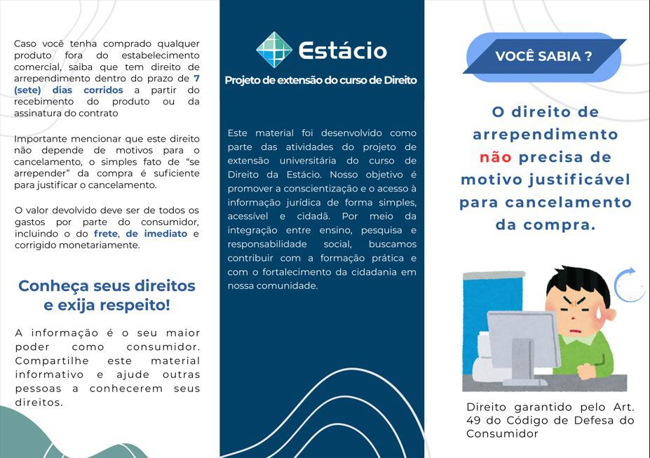
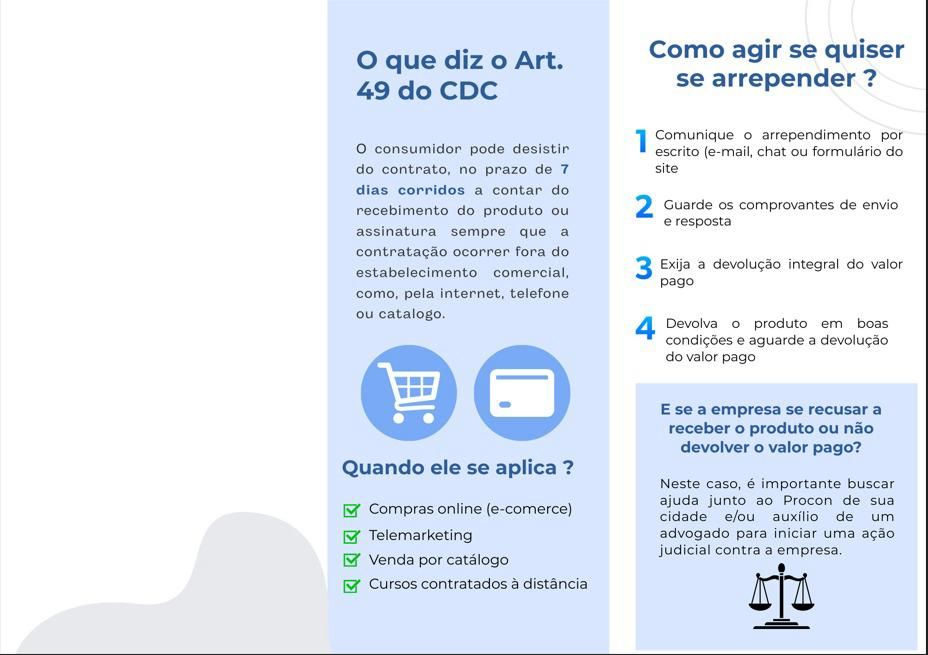

<!DOCTYPE html>
<html lang="pt-br">
<head>
  <meta charset="UTF-8">
  <meta name="viewport" content="width=device-width, initial-scale=1">
  <title></title>
  
  </head>
<body>

<header>
  <h1>Evidências</h1>
  
Trabalho de Extensão

</header>

<nav>
  <a href="https://cahcrvg.github.io/TrabalhoExtensao/">Início</a>
  <a href="#">Discentes</a>
</nav>

  

  <h1>Fotos</h1>
     
  
